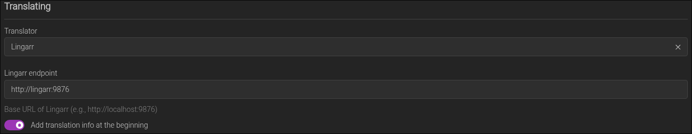
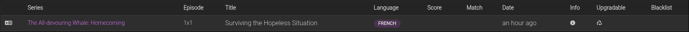
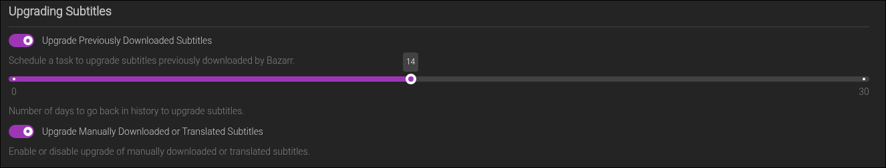

# Bazarr Subtitle Translation Automation Script

A Python script that automates subtitle translation in Bazarr by leveraging its API. The script identifies missing subtitles for movies and series, checks if existing subtitles can be translated into the missing language, and queues translation requests automatically.

> ⚠️ **Critical Warning**
>
> This script can trigger **a high volume of subtitle translations** automatically depending on the settings.  
> If your Bazarr instance is linked to a **paid translation service**, this could lead to **unexpected charges** due to:
>
> - No error limits
> - No rate limiting
> - No maximum translation cap
>
> ⚠️ **Use at your own risk**. You are responsible for monitoring and controlling usage.  
> I am planning on adding limits to make it safer but for now there are NONE

---

## Features

- Automatically scans movies and series for missing subtitles.
- Checks if existing subtitles can be translated into the missing language.
- Queues translation requests using Bazarr API.
- Configurable scanning intervals and worker concurrency.
- Logs actions and errors for easier monitoring.

---

## Why?

Bazarr supports subtitle translation via Lingarr, and Lingarr can perform automatic subtitle translations. However, when subtitles are translated directly through Lingarr (outside of Bazarr’s request system), **Bazarr is unaware of those translations**. As a result:

- Bazarr does not register the translated subtitles in its internal state.
- Bazarr will never attempt to **upgrade** or **replace** the translated subtitles with higher-quality versions from its indexers.

This script was created to address that gap. It automates the process of requesting translations **through Bazarr’s API**, so:

- Bazarr tracks the translations.
- Upgrades to translated subtitles are possible [(if the proper setting is set, see section)](#translated-subtitle-upgrade).
- Everything integrates smoothly with Bazarr’s native behavior.

Since Bazarr currently has **no automation features** for translation (the process is fully manual), this script bridges that functionality gap by making translation automatic and trackable.


## Configuration

The script is configured via environment variables using a `.env` file in the same directory. Below is a list of supported variables with their descriptions and default values:

[Docker compose example](#docker-compose-example)

| Variable                      | Description                                                                                       | Default         |
|-------------------------------|---------------------------------------------------------------------------------------------------|-----------------|
| `BAZARR_BASE_URL`             | The full base URL of your Bazarr instance (e.g., `http://localhost:6767`).                       | **Required**    |
| `BAZARR_API_KEY`              | Your Bazarr API key. This is required to authenticate API calls.                                 | **Required**    |
| `BASE_LANGUAGES`              | Comma-separated list of subtitle languages to use as source for translation in code2 (e.g., `en,fr`).     | empty list (`[]`) |
| `TO_LANGUAGES`                | Comma-separated list of subtitle languages that should be present or translated to also in code2 (e.g., `en,fr`).              | empty list (`[]`) |
| `TRANSLATION_REQUEST_TIMEOUT`| Time (in seconds) to wait for the translation to complete or consider it failed (SEE NOTE 2)                    | 900 (15 minutes) |
| `NUM_WORKERS`                 | Number of worker threads to handle translation queue requests in parallel. That means, How many translation could be processing at the same time                      | 1               |
| `INTERVAL_BETWEEN_SCANS`     | Interval (in seconds) between each automatic scan of your Bazarr library.                        | 300 (5 minutes) |
| `LOG_LEVEL`                   | Logging level. Options: `DEBUG`, `INFO`, `ERROR`.                                     | INFO            |
| `LOG_DIRECTORY`              | Directory where logs will be saved. Will be created if it doesn't exist.                         | `logs/`         |
| `SERIES_SCAN`                 | Whether to scan TV series for missing subtitles (`true` or `false`).                             | true            |
| `MOVIES_SCAN`                 | Whether to scan movies for missing subtitles (`true` or `false`).                                | true            |

---

> **Note 1:**  
> You must provide both `BAZARR_BASE_URL` and `BAZARR_API_KEY` for the script to interact with your Bazarr server.

> ⚠️ **IMPORTANT TO NOT HAVE DUPLICATED TRANSLATION REQUEST**.
>
> **Note 2:**  
> The `TRANSLATION_REQUEST_TIMEOUT` value **must be set to at least the longest time** it typically takes to complete a subtitle translation. If set too low, the script might queue duplicate translation requests for subtitles already in translation.

> **Note 3:**  
> `BASE_LANGUAGES` determines which subtitle languages can be used as source material for translation.  
> `TO_LANGUAGES` sets the target subtitle languages you want to ensure are available. The script will attempt to translate from any available `BASE_LANGUAGES` to any missing `TO_LANGUAGES`.
> Base languages can be repeated in to languages and vise versa.

> **Note 4:**
> If you want lingarr to do the translation check the [Lingarr section](#lingarr)

## Usage

1. Set the desired environment variables or use the defaults.  
2. Run the script by executing:
3. The script will periodically scan Bazarr via API, detect missing subtitles, and queue translation tasks as needed.

---

## How it Works

1. **Scan**: The script calls Bazarr API to get the current list of movies and series.  
2. **Check Subtitles**: For each item, it checks which subtitle languages are missing.  
3. **Find Existing Subtitles**: If a subtitle in another language exists, it requests translation of that subtitle into the missing language via Bazarr API.  
4. **Queue Translation**: Translation requests are queued and processed by Bazarr automatically.

---

## Logging

Logs are saved to the directory specified by `LOG_DIRECTORY` with the log level set by `LOG_LEVEL`. This helps monitor script actions and troubleshoot issues.

---

## Lingarr

For lingarr to do the translation, make sure to have lingarr setup correctly in Bazarr's settings as show below (Those setting will change for you but Lingarr has to be selected)
`Settings -> Subtitles -> Translating`



If setup correctly, in Bazarr's history, translations should have "Upgradable" icon



## Translated Subtitle Upgrade

If you want the translated subtitle to be upgraded if bazarr finds subtitle in that languages. You MUST have the upgrade setting on, see below (Those setting may change for you but `Upgrade Manually Downloaded or Translated Subtitles` must be enabled)
`Settings -> Subtitles -> Upgrading Subtitles`



## Docker Compose Example

```yml
services:
    test:
        image: ghcr.io/zelak312/bazarr_autotranslate:latest
        environment:
            - BAZARR_BASE_URL=<bazarr_url>
            - BAZARR_API_KEY=<bazarr_api_key>
            - BASE_LANGUAGES=<languages>
            - TO_LANGUAGES=<languages>
            - LOG_LEVEL=info
            # any other configuration needed
        volumes:
            # if logs are wanted 
            - ./logs:/usr/src/app/logs
```

## Contributing

Feel free to open issues or submit pull requests to improve this tool!

---

## License

MIT License
